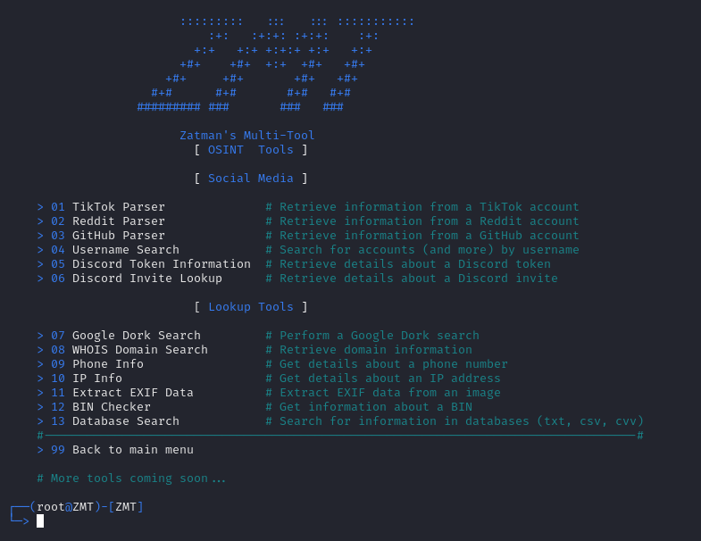

# ZMT

ZMT - Zatman's MultiTool

# Features

**01-03. TikTok/Github/Reddit Parser** - Collect information from accounts

**04. Username Search** - Search for accounts (and more) by username

**05. Discord Token Information** - Extract details about a Discord token

**06. Discord Invite Lookup** - Retrieve information related to a Discord invite

**07. Google Dork Search** - Perform a Google Dork search

**08. WHOIS Domain Search** - Get information about domain

**09. Phone Info** - Retrieve information about a phone number

**10. IP Info** - Get details about an IP address

**11. Extract EXIF Data** - Extract EXIF metadata from an image

**12. BIN Checker** - Get information about a BIN (Bank Identification Number)

**13. Database Search** - Search through databases (txt, csv, CVV) for relevant information (You need to place your databases in the 'database' folder)

*More tools coming soon...*

# Installation

# Windows

01. Download Python, open the installer and click on *add python to PATH*

02. Open CMD in ZMT directory

03. Paste these commands:

        pip install -r requirements.txt
        python zmtmain.py

# Linux

01. Paste these commands in terminal:

        sudo apt update
        sudo apt upgrade
        sudo apt install python git
        git clone https://github.com/zatmannn/ZMT
        cd ZMT
        pip install -r requirements.txt
        python zmtmain.py

# Termux

01. Paste these commands in terminal:

        pkg update
        pkg upgrade
        pkg install python git
        git clone https://github.com/zatmannn/ZMT
        cd ZMT
        pip install -r requirements.txt
        python zmtmain.py

# Disclaimer

By using this script, you agree that you hold responsibility and accountability of any consequences caused by your actions.

The developer is not responsible for any damage caused by the use of this tool.
